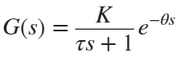
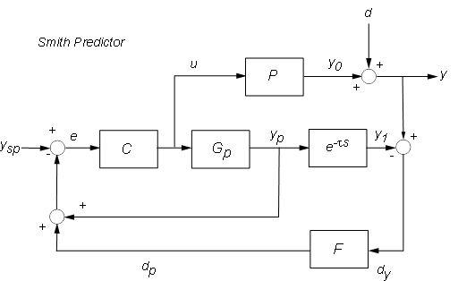

## PID_rs

What is this?! A no_std PID controller implementation in Rust for embedded systems.
STILL UNDER DEVELOPMENT

This crate implements a full-featured, small-footprint PID controller that runs in a `#![no_std]` environment. It provides:

- Setpoint weighting for proportional and derivative actions
- Bumpless transfer when changing gains
- Output clamping and integral limits to prevent actuator saturation
- Clamping anti-windup (integral adjustment when output is saturated)
- Options for proportional-on-measurement and derivative-on-measurement
- Simple derivative filtering
- Both synchronous and async compute paths (async uses `embassy_time`)

## Why this crate

Embedded controllers often run without the standard library. This implementation is:

- Designed for `#![no_std]` targets (uses `embassy_time` for async timing)
- Small and explicit: you control limits, filter constants, and setpoint weighting
- Practical: includes common PID refinements used in industrial systems (setpoint weighting, anti-windup, bumpless transfer)

## Key concepts

### Setpoint weighting

Setpoint weighting changes how the setpoint contributes to the P and D terms.

- Proportional setpoint weight b (0.0..=1.0): P term uses Kp*(b*setpoint - measurement).
  - b = 1.0 -> traditional PID P term uses full setpoint
  - b = 0.0 -> P acts only on measurement (no setpoint kick)

- Derivative setpoint weight c (0.0..=1.0): D term can be formed as Kd*(c*d(setpoint) - d(measurement)).
  - c = 1.0 -> traditional D (derivative of setpoint included)
  - c = 0.0 -> measurement-only derivative (eliminates derivative kick on setpoint changes)

Setpoint weighting is useful to eliminate derivative kick on sudden setpoint changes and to tune setpoint-following behaviour separately from disturbance rejection.

### Bumpless transfer

When controller gains are updated at runtime the library attempts a "bumpless transfer": it adjusts the integral term so the controller output remains continuous when the gains change. This reduces sudden jumps in actuator commands when tuning live.

In the implementation, calling `set_gains(kp, ki, kd)` performs a simple adjustment of the integral to compensate for the change in proportional scaling.

### Clamping and anti-windup

You can specify output limits and integral limits. When the computed controller output is clamped to actuator limits, the controller can use clamping anti-windup to adjust the integral term so it does not keep integrating while the actuator is saturated.

Anti-windup mode in this crate is "clamping": if the raw output would be outside limits the integral term is recomputed so the final clamped output equals the sum of P, I and D terms without further windup.

### Smith Predictor. Tuning more aggressively!!
There are limitations of PI control for processes with long dead time. In many real-world processes (like chemical reactors, distillation columns, or temperature control in large systems), there's a significant delay between when a control action is applied (e.g., opening a valve) and when its effect is measured at the output. A standard PID controller reacts to the past error, often leading to:

  - Slow and sluggish response
  - Overshoot and instability
  - Very conservative tuning (low gains) to maintain stability, which degrades  performance.

A Smith Predictor is used to handle the processes with significant time delays (dead time). It's a model based predictor-controller that 'predicts' the effort of effect to the control action on the process output, this allows better performance than the standard feedback controller when delays are present.

Process Modelling:
  - Supports N-th order difference equation models
  - Includes time delay buffer (FIFO) to simulate process delays
  - Provides helper functions for common models (FOPTD, SOPTD, integrator)

### FOPTD and SOPTD
Both are standard model structures used in process control to approximate real-world dynamic systems with time delays.
FOPTD (First-Order Plus Time Delay) also called "first-order lag with dead time"

  K  = Process gain (steady-state gain)
  τ  = Time constant (speed of response)
  θ  = Time delay (dead time)
Step response: Shows a delay (θ), then exponential approach to final value

SOPTD (Second-Order Plus Time Delay)
Read here: [Optimal PID Tuning with FOPTD and SOPTD](https://www.researchgate.net/publication/222402204_Optimal_tuning_of_PID_controllers_for_FOPTD_SOPTD_and_SOPTD_with_lead_processes)

Core Algorithm of Smith-Predictor:

  - Computes delay-free model output
  - Compares delayed model output with actual measurement
  - Predicts "present" output by adding model error
  - PID controller acts on the predicted output instead of delayed measurement. Huh!



Math is done using Rust implementations of the C math library [libm](https://crates.io/crates/libm)

Example Usage:
```rust
// Create a PID controller with gains kp, ki, kd
let pid = PidController::new(2.0, 0.1, 0.5)?;

// Create a first-order model with delay
let (num, den) = smith_models::create_foptd_model::<2>(1.0, 5.0, 10);

// Create Smith Predictor with 10 samples delay
let mut smith = SmithPredictor::new(pid, num, den, 10)?;

// Use in control loop
let control_output = smith.compute(setpoint, measurement);
```

References:
1. [Mathworks Smith-Predictor](https://www.mathworks.com/help/control/ug/control-of-processes-with-long-dead-time-the-smith-predictor.html)
2. [How to approximate FOPTD](https://www.mathworks.com/matlabcentral/answers/2093891-how-approximate-model-fopdt)
3. [some math on FOPDT](https://apmonitor.com/pdc/index.php/Main/FirstOrderSystems)


Example PID usages without Smith-predictor (synchronous):

```rust
use pid_rs::PidController;
use embassy_time::Duration;

// Create a controller with Kp, Ki, Kd
let mut pid = PidController::new(1.5, 0.05, 0.2).unwrap()
    // limit actuator output to [-10, 10]
    .with_output_limits(-10.0, 10.0).unwrap()
    // setpoint weighting: b=1.0 (P sees setpoint), c=0.0 (no derivative kick)
    .with_setpoint_weighting(1.0, 0.0).unwrap()
    // discrete sample time
    .with_sample_time(Duration::from_millis(10)).unwrap();

// In your control loop
let setpoint = 100.0f32;
let measurement = 95.0f32;
let output = pid.compute(setpoint, measurement);
// send `output` to actuator
```

(async) using `embassy_time` for correct timing between samples:

```rust
use pid_rs::PidController;
use embassy_time::Duration;

#[embassy_executor::main]
async fn main(spawner: embassy_executor::Spawner) {
    let mut pid = PidController::new(1.0, 0.1, 0.01).unwrap()
        .with_sample_time(Duration::from_millis(50)).unwrap();

    loop {
        let setpoint = 50.0;
        let measurement = read_sensor().await; // your async sensor read from your MCU
        let u = pid.compute_async(setpoint, measurement).await;
        //...
    }
}
```

### Tuning setpoint weighting

- For most systems: b = 1.0, c = 0.0 (full P response, derivative on measurement only)
- For very gentle setpoint following (avoid overshoot): b between 0.0 and 0.5, c small (0.0..0.2)

## API highlights

- `PidController::new(kp, ki, kd) -> Result<PidController, PidError>`
- Builder-style config methods (returning `Self` or `Result<Self, PidError>` where validation is performed):
  - `with_output_limits(min, max)`
  - `with_integral_limits(min, max)`
  - `with_setpoint_weighting(b, c)`
  - `with_sample_time(Duration)`
  - `with_proportional_on_measurement(bool)`
  - `with_derivative_on_measurement(bool)`
  - `with_derivative_filter(time_constant)`
  - `with_anti_windup(bool)`

  -`create_foptd_model(N)`
  -`create_soptd_model(N)`
  -`create_integrator_model(N)`

- Control methods:
  - `compute(setpoint, measurement) -> f32` (synchronous)
  - `compute_async(setpoint, measurement) -> f32` (async with timing)
  - `reset()` to clear internal integrator and history
  - `set_gains(kp, ki, kd)` updates gains and performs bumpless transfer adjustments

## Design notes and edge cases

- Time handling: The controller computes dt using stored `last_time` and the provided `Instant`. The `async` compute path waits for the configured sample time between updates. For deterministic control loops you can call `compute` at a constant rate and ensure `with_sample_time` matches your loop.
- Numeric safety: constructor and setters validate for NaN/inf and reject negative gains where appropriate.
- When switching from P-on-setpoint to P-on-measurement or toggling derivative modes, consider calling `reset()` if you want to remove historical state.

## Tests

There are unit tests in `src/lib.rs` that exercise setpoint weighting behaviour and basic bounds checks. Run tests on a host build (some features are `no_std` but tests run on host):

```bash
cargo test -v
```
## Known issues
`cargo build` is successful but `cargo test --verbose` fails with: `Linking with cc failed!` Too lazy to start poking at linker errors for now...

## Contribution

Contributions are welcome:

1. Fork the repository and create a feature branch.
2. Add tests for new behaviours or bug fixes.
3. Open a pull request describing the change, motivation, and any compatibility considerations.

I will really appreciate

# Future Works
Complete examples showing how to use `pid_rs` with real world MCUs and sensors/actuators/plants.
Use `defmt` to print messages.

## License

See the `LICENSE` file in the repo root.

---


